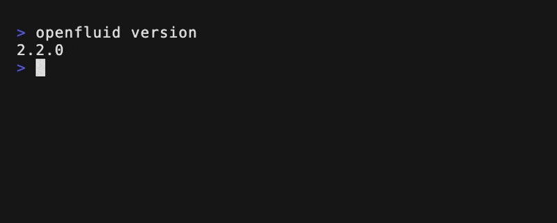

<div align="center">
  <a href="https://www.openfluid-project.org">
    
  </a>
<br/>
<br/>

[](https://github.com/OpenFLUID/openfluid/actions/workflows/CI-ubuntu.yaml) &nbsp;&nbsp;
[](https://github.com/OpenFLUID/openfluid/actions/workflows/CI-macos.yaml) &nbsp;&nbsp;
[](https://github.com/OpenFLUID/openfluid/actions/workflows/CI-windows.yaml)
<br/>

<a href="https://github.com/OpenFLUID/openfluid/issues">Report bug or issue</a>
</div>

<br/>

- [About OpenFLUID](#about-openfluid)
  - [Features](#features)
  - [Built with](#built-with)
- [Getting started](#getting-started)
  - [Installation](#installation)
    - [Linux](#linux)
    - [MacOS](#macos)
    - [Windows](#windows)
    - [From sources](#from-sources)
  - [Manuals and Trainings](#manuals-and-trainings)
- [Resources](#resources)
- [Authors and License](#authors-and-license)
- [Contact](#contact)


# About OpenFLUID

OpenFLUID is a software environment for spatial modelling in landscapes. Based on an explicit representation of spatial objects and their interactions, OpenFLUID is designed for modelling dynamics at different spatial and temporal scales. It provides functionalities for the development and integration of computational codes, model coupling, parameterization and execution of simulations. It is also a collaborative framework for the capitalization and sharing of multi-disciplinary scientific models.  
OpenFLUID has already been applied in various contexts: hydrology, diffuse pollution, agricultural practices, erosion, land use planning, etc.
Free, open-source and based on open standards, OpenFLUID is fully commited to open and reproducible science approaches.  

<div align="center">
  
</div>


## Features

* 🚀 Performance oriented simulation engine
* 👩‍💻 Open architecture to plug your own simulation models
* 🗂️ Extensible output formats through plugins
* 🖥️ User friendly software environment for development and integration of models
* ⌨️ Command line interface
* 📚 Integrated documentation system for models
* 🤝 Collaborative system to store and share models source codes


## Built with

OpenFLUID relies on several tools and libraries

* C++17
* [Boost](https://www.boost.org/) for low-level structures
* [GDAL](https://gdal.org/) for geospatial data I/O and management
* [JSON](https://github.com/nlohmann/json) for metadata and settings I/O
* [TinyXML](https://github.com/leethomason/tinyxml2) for datasets I/O
* [libcurl](https://github.com/curl/curl) for network operations
* [CMake](https://cmake.org/) for build/test/packaging configuration and management
* [Doxygen](https://www.doxygen.nl/) for technical documentation

* [Qt6](https://www.qt.io/) for UI framework and applications (Qt5 deprecated)
* [Pandoc](https://pandoc.org/) for user-generated documentation conversion


# Getting started

## Installation

OpenFLUID is available for Linux, MacOS and Windows. You can download it from the [official web site](https://www.openfluid-project.org/).

Once the installation has been performed using instructions below according to the operating system, open a terminal (Linux, MacOS) or a command prompt (Windows) an type `openfluid version` to check if the installation is successful.  
The OpenFLUID version is displayed if it is correctly installed.

<div align="center">
   
</div>

### Linux

1. Download the package corresponding to the Linux distribution
1. Open a terminal
1. Use the dedicated package installer tool

Ubuntu/Debian
```sh
sudo apt install /path/to/<openfluidpackagfile>.deb
```

Fedora
```sh
sudo dnf install /path/to/<openfluidpackagfile>.rpm
```

### MacOS

1. Install Brew if not already present (see also https://brew.sh/)
```sh
/usr/bin/ruby -e "$(curl -fsSL https://raw.githubusercontent.com/Homebrew/install/master/install)"
```

2. Add OpenFLUID tap for Brew
```sh
brew tap OpenFLUID/openfluid
```

3. Install OpenFLUID using Brew (with --no-quarantine option to avoid Gatekeeper restrictions in recent MacOS versions)
```sh
brew cask install --no-quarantine openfluid
```

### Windows

1. Download the OpenFLUID installer
1. Download the OpenFLUID additional tools installer
1. Execute the OpenFLUID installer (optional but recommended)
1. Execute the OpenFLUID additional tools installer (optional but recommended)

Additional information is available on the [OpenFLUID Community site](https://community.openfluid-project.org/start/install/#windows)


### From sources

Detailed instructions for build and installation from sources are available on the [OpenFLUID Community site](https://community.openfluid-project.org/coredev/build/).


## Manuals and Trainings

The [OpenFLUID manual](https://community.openfluid-project.org/start/manuals/) and the [training sessions docs](https://community.openfluid-project.org/start/trainings/) are available online.  
_(the training sessions documents are in french 🇫🇷)_


# Resources

* [OpenFLUID web site](https://www.openfluid-project.org/)
* [OpenFLUID Community](https://community.openfluid-project.org/)
* [GitHub](https://github.com/OpenFLUID) organization: repositories, issues, ...
* [Overview slideshow](https://bit.ly/OpenFLUID_overviewFR) _(in french 🇫🇷)_
* OpenFLUID [coding style](https://community.openfluid-project.org/scidev/codestyle/)


# Authors and License

OpenFLUID is developed at [LISAH](https://www.umr-lisah.fr/) (Montpellier, France), a research joint unit on interactions between soil, agrosystems and hydrosystems. It is actively supported by the [INRAE](https://www.inrae.fr/en) research institute on agriculture, environment and food.  

See the [AUTHORS.md](AUTHORS.md) file for details about the developers.  

OpenFLUID is distributed as a free and open-source software. See the [LICENSE](LICENSE) file for details.


# Contact

To contact us, see the [OpenFLUID team page](https://www.openfluid-project.org/who/).  
You can also join the OpenFLUID slack workspace. Ask the team for an invitation link.

