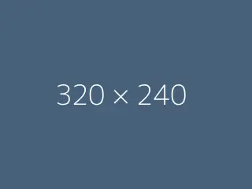

This ia a Markdown formatted documentation


# Part 1

## Part 1.1

Lorem ipsum dolor sit amet, consectetur adipiscing elit. Nam sit amet nisi ut nulla consectetur condimentum quis a lacus. 
Donec viverra vitae diam ac cursus. Fusce mattis placerat eleifend. Sed eros est, varius tincidunt sodales sed, placerat a libero. 
Duis bibendum vulputate finibus. Ut tortor leo, sodales ut lacinia quis, lobortis suscipit risus. Duis facilisis urna non aliquet viverra. 
Integer tellus urna, commodo vel blandit at, fermentum id nunc. Pellentesque eget nisi vitae neque tempus scelerisque. 
Vivamus et accumsan turpis, convallis vestibulum ante. 

## Part 1.2

Phasellus in nulla odio. Sed malesuada, nibh non rutrum facilisis, quam turpis laoreet nulla, eu tincidunt mauris magna in tortor. 
Nam consectetur porta condimentum. Donec quam quam, pulvinar ac tellus non, tempor sagittis dolor. 
Phasellus pretium risus vitae leo fermentum, a tempor metus lobortis. Interdum et malesuada fames ac ante ipsum primis in faucibus.  
  




The OpenFLUID software platform for spatial modelling in landscapes [@Fabre2013]


# Part 2

Ut at libero ullamcorper, **volutpat sapien eu**, _tempor nunc_. Nam eros elit, rhoncus nec diam et, consequat pretium nisi. 
Proin mattis scelerisque velit quis dictum. Fusce `convallis libero` nec quam euismod finibus. Vivamus at consectetur neque. 

```
Maecenas vitae finibus diam. Maecenas eget auctor lectus, accumsan tincidunt diam.
Morbi id urna elementum, congue ex pretium, viverra quam. 
Vestibulum hendrerit massa eget erat laoreet malesuada.
```

Praesent [vitae neque](https://www.openfluid-project.org) vitae lectus hendrerit gravida vel in velit. Donec viverra mi finibus libero mollis, ut porta metus ultrices. 


# References